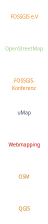

# FOSSGIS-WorkAdventure-Maps

This repo contains some maps built with the [Tiled Map Editor](https://www.mapeditor.org/) which might be used at some [FOSSGIS](https://fossgis.de/) events in a [WorkAdventure](https://workadventu.re/)-based world. See the ["Create your map!" howto](https://workadventu.re/create-map.html) about how to build maps.

## Maps

- [FOSSGIS-Update](fossgis-update.json) - Map which might be used at the upcoming [FOSSGIS-UPDATE event](https://fossgis.de/news/2020_12_04_fossgis-update/).

## Used Tilesets

Please note that the tilesets are included as [Git submodules](https://git-scm.com/book/en/v2/Git-Tools-Submodules), so you will have to `git submodule update --init --recursive` them before they are available.

* [rC3-OSM-Tileset](https://github.com/mstock/rC3-OSM-Tileset): Tileset based on the [OpenStreetMap Carto](https://github.com/gravitystorm/openstreetmap-carto) map style.
* [world-tiles](https://git.cccv.de/rc3/world-tiles): Shared tilesets for the [rC3 world](https://rc3.world) that was built for the [rC3 (Remote Chaos Experience) conference](https://events.ccc.de/2020/09/04/rc3-remote-chaos-experience/). Please note that these tilesets may be provided under a different license than the remainder of this repository.

## Contained Tilesets

### FOSSGIS-UPDATE Logos

`tilesets/fossgis-update/logos.png`: Logos for the FOSSGIS-UPDATE event map.

### FOSSGIS-UPDATE Labels

`tilesets/fossgis-update/labels.png`: Labels for the FOSSGIS-UPDATE event map.

## License

[CC0 1.0 Universal](https://creativecommons.org/publicdomain/zero/1.0/)

### Logos

* [FOSSGIS logo](https://commons.wikimedia.org/wiki/File:FOSSGIS_Logo.png): FOSSGIS e.V., [Creative Commons Attribution-Share Alike 3.0 Germany](https://creativecommons.org/licenses/by-sa/3.0/de/deed.en)
* [OpenStreetMap logo](https://wiki.openstreetmap.org/wiki/File:Public-images-osm_logo.svg): Ken Vermette, [Creative Commons Attribution-ShareAlike 3.0](https://creativecommons.org/licenses/by-sa/3.0/)
* [uMap logo](https://wiki.openstreetmap.org/wiki/File:Umap_logo.svg): [Ybon](https://wiki.openstreetmap.org/wiki/User:Ybon), [Creative Commons Attribution-ShareAlike 2.0](https://creativecommons.org/licenses/by-sa/2.0/)
